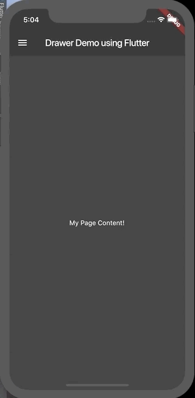

# Drawer Flutter

En las aplicaciones que implementan Material Design, hay dos opciones para la navegación, tabs y drawers, cuando no hay espacio suficiente para soportar tabs, los Drawers dan una alternativa.

Para poder agregar el Drawer a nuestra app, necesitamos que este envuelto(Wrap) en un Widget Scaffold, este provee una estructura visual consistente para las apps que utilizan Material Design.

Luego de tener el Scaffold podemos crear nuestro Drawer y llenarlo con el Listview que va contener cada uno de los items.

